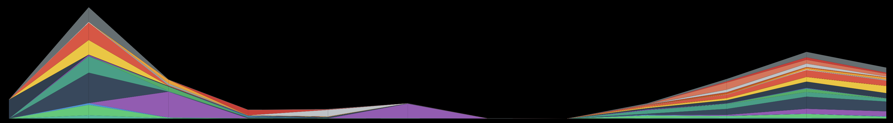

# p5.js Stacked Area Chart

This is a function that draws a modular p5js stacked area chart using the given parameters.



## Usage

Call the function `stackedAreaChart` with the following parameters:

- `width` (number): The width of the graph.
- `maxHeight` (number): The maximum height of the graph.
- `x` (number): The x-coordinate of the top-left corner of the graph.
- `y` (number): The y-coordinate of the top-left corner of the graph.
- `legend` (array): An array of objects representing the data series in the graph. Each object should have the properties "id" (a unique identifier for the series) and "color" (a string representing the color to use for the series, in CSS format).
- `data` (array): An array of arrays representing the data to be plotted on the graph. Each inner array should contain objects with properties "id" (matching one of the ids in the legend), and "value" (the value to plot for that data point).

## Example

```
let legend = [
  { id: "series1", color: "#FF0000" },
  { id: "series2", color: "#00FF00" },
  { id: "series3", color: "#0000FF" },
];

let data = [
  [
    { id: "series1", value: 10 },
    { id: "series2", value: 20 },
    { id: "series3", value: 30 },
  ],
  [
    { id: "series1", value: 20 },
    { id: "series2", value: 10 },
    { id: "series3", value: 40 },
  ],
  [
    { id: "series1", value: 30 },
    { id: "series2", value: 30 },
    { id: "series3", value: 20 },
  ],
];

stackedAreaChart(400, 200, 50, 50, legend, data);
```

## Parameters

- `width` (number): The width of the graph.
- `maxHeight` (number): The maximum height of the graph.
- `x` (number): The x-coordinate of the top-left corner of the graph.
- `y` (number): The y-coordinate of the top-left corner of the graph.
- `legend` (array): An array of objects representing the data series in the graph. Each object should have the properties "id" (a unique identifier for the series) and "color" (a string representing the color to use for the series, in CSS format).
- `data` (array): An array of arrays representing the data to be plotted on the graph. Each inner array should contain objects with properties "id" (matching one of the ids in the legend), and "value" (the value to plot for that data point).

## License

This component is licensed under the MIT License. Developed as part of [Aaron Siegel](https://twitter.com/datadreamer)'s "Designing Digital Experiences" class at the [USC Iovine & Young Academy](https://iovine-young.usc.edu/).
